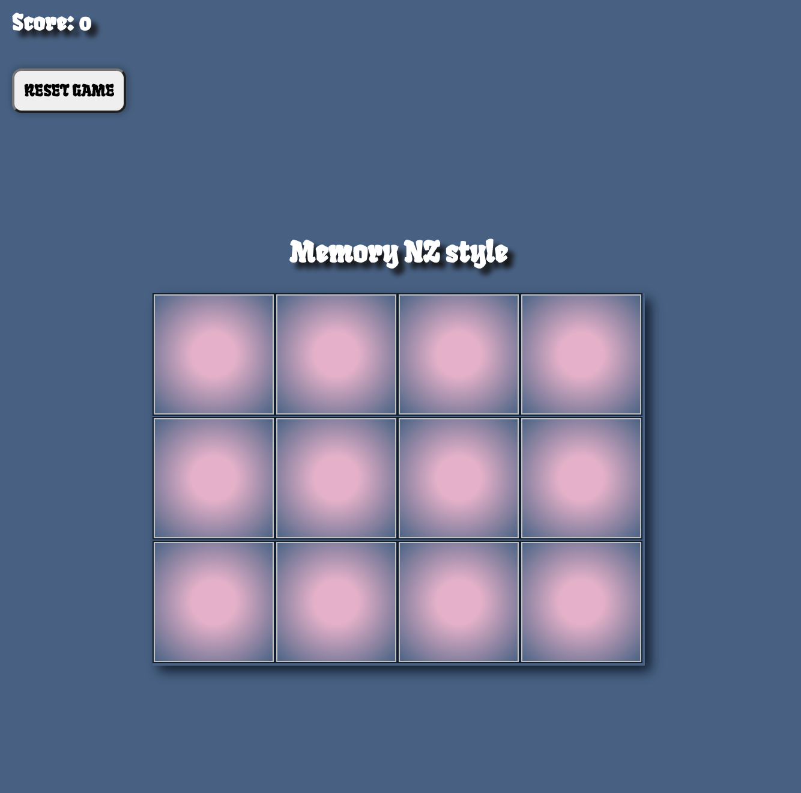
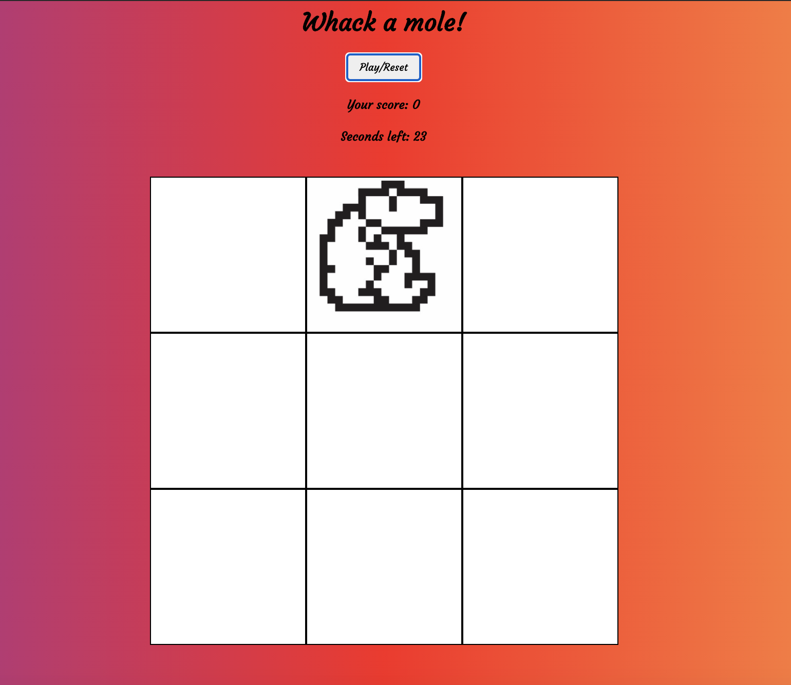
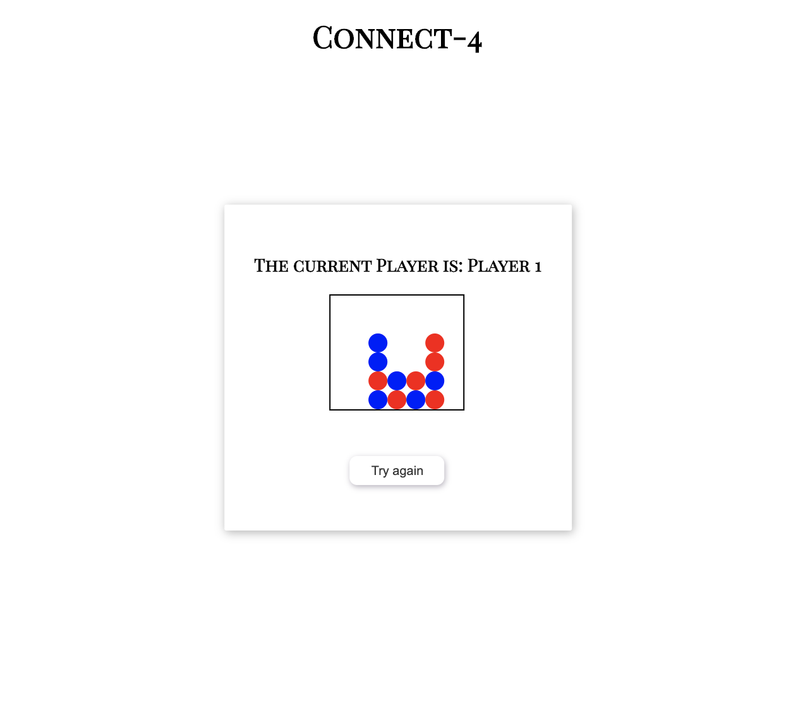
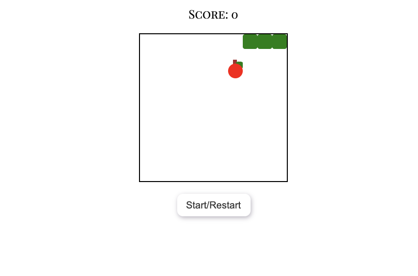
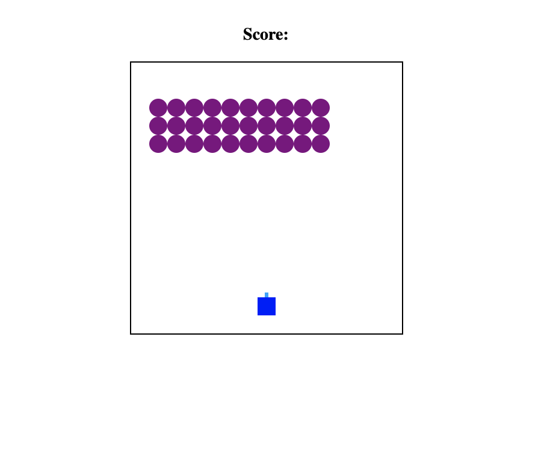
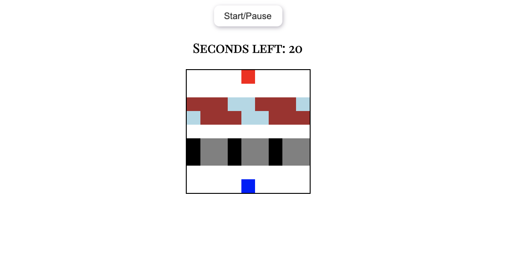
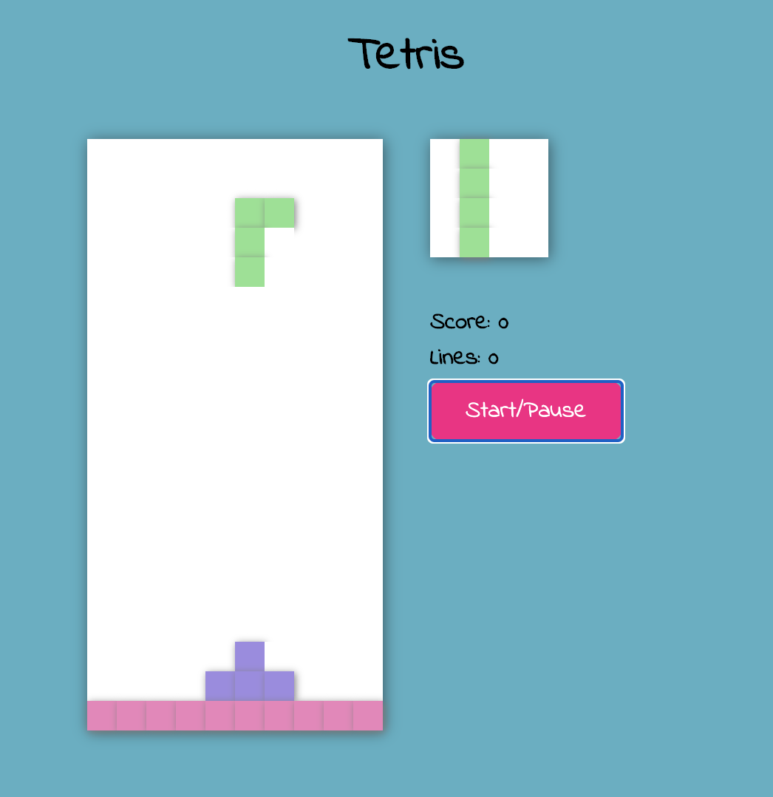

# 7 games

## Built with
HTML5, CSS, JavaScript

## About this repo  
Just for the fun of it.  

## Contents  
* Memory
* Whack-a-mole
* Connect4
* Snake
* Space invaders
* Frogger
* Tetris  

### Acknowledgement
Credit goes to FreeCodeCamp.org and Ania Kubow for amazing game tutorials.